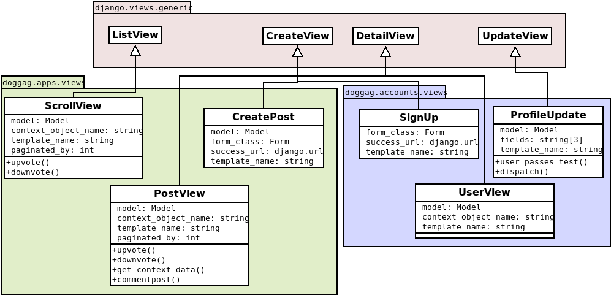

Note that django provides many ways of implementation for a back end. Using object oriented, most of the classes created for this website are extensions of previously existing classes in django framework, which have all the segmentation needed in a OOP style of software engineering.  

For the models, the django framework has the basic class "Model" from django.db.models, which already implements the creation, deletion and changing of information in the database according to the django model. The data types are also class instances (objects) of django.db.models, since this is the way to implement a connection with the database.  

In our case, we go further and use an already existing authentication system model from django.contrib.auth to create, autheticate and manage our users, with the difference each user has its own profile.  

  

Using OOP, the views of the website are mostly implemented in generic versions of django provided views, with only some existing attributes and operations overwrite. It is to be noticed that most of the needed operations are already created, such as fetching information from database and replying the user with an http response (which is the purpose of a view in django), only some attributes are needed for the view to work properly and "fill" the HTML template.  

