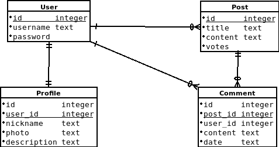

### Proposal for Software Engineering project

# Doggag
---

## Enginheroes
Gan Xiao Nan  
Luís Ferreira

---

[Project overview]  
The project consists of an web app to see, vote and comment on dog pictures. It will be developed mainly using python (django) with a user authentication system for uploading images, voting and commenting.
It will be separated in a couple views: "index" view where the posts are listed and ordered by upvotes; a "detail" view where we can see the picture and comment; and user related views where we can log in, edit profile and upload posts.

---

[System architecture]  
It's a simple web app with a database and an image storage.

---

[Domain model]  
  

---

[Class diagram]  
Class diagrams are written on [classes](Class.md)

---

[ER diagram]  
There are four models that we are using reflect in four tables with foreign key relationships between them.  

---

[Database tables]  

We use a table of an already existing django class "User", from django.contrib.auth, that will help with authentication. The other tables are from original model classes. It is to note that comment table primary key is only complete with the post foreign key and the profile primary key is only complete with the user foreign key. Since the database is SQLite, date is stored as TEXT and for images only the path is stored as TEXT.  

---

[GUI]  
The graphical user interface is simple and straight forward. Mainly just HTML/CSS and a small script with jQuery.  
Home page:  
   
Login page:  
   
Post detail:  
  
User profile page:  
  
Update user profile:  
   
Upload post page:  

---

[Hosting website]  

[http://doggag.pythonanywhere.com/](http://doggag.pythonanywhere.com/)
