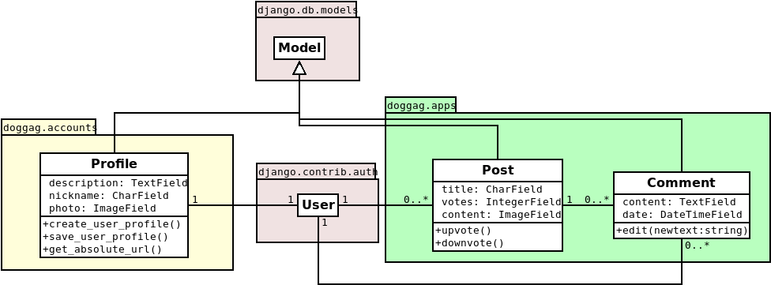

### Proposal for Software Engineering project

# Doggag
---

## Enginheroes
Gan Xiao Nan  
Luís Ferreira

---

[Project overview]  
The project consists of an web app to see, vote and comment on dog pictures. It will be developed mainly using python (django) with a user authentication system for uploading images, voting and commenting.
It will be separated in a couple views: "index" view where the posts are listed and ordered by upvotes; a "detail" view where we can see the picture and comment; a "user" view where we can see and edit our profile, and post new cute dog pictures; and a "login" view where the user logs in to the page.

---

[System architecture]  
It's a simple web app with a database and an image storage.

---

[Domain model]  

---

[ER diagram]  

---

[Database tables]  

First we propose to use an extension of the class, and therefore the database table, of an already existing django class, from django.contrib.auth, that will help with authentication. The other tables are from original model classes.  
It is to note that comment table primary key is only complete with the post foreign key.

---

(Things to talk about and "cheat sheet")

- [x] Project title, team name & members on the front page
- [x] Overview of the project in around half a page
- [x] Proposed system architecture
- [ ] Proposed domain model
- [x] Proposed entity-relationship diagram
- [x] Proposed database tables
- [x] Proposed user interface
- [ ] Website(s) where the main Django server is based.
